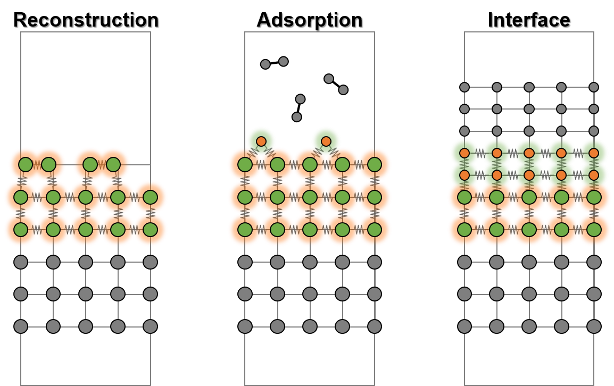
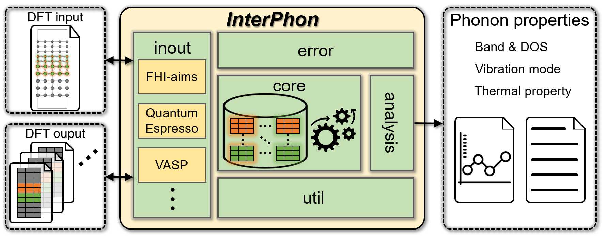

# Table of Contents
* [Introduction](#introduction)
* [InterPhon framework](#interphon-framework)
* [How to cite](#how-to-cite)
* [Documentation](#documentation)
* [Installation](#installation)
* [Basic usage in conjunction with VASP](#basic-usage)
* [Important files](#important-files)


<a name="introduction"></a>
# Introduction
The interfacial region introduces different kinds of vibrations originating from the different stoichiometry and bonding geometry compared to the bulk environment. However, there has been a limitation in applying ab initio phonon calculations to interfaces due to the excessive computational cost, introduced by their large number of atoms and broken symmetry. The problems are intrinsically inevitable within a three-dimensional (3D) density functional theory (DFT) framework representing interfacial systems by supercells as shown in **Figure 1**.


<div align='center'><strong>Figure 1. Representative systems to which <i>InterPhon</i> can be applied. Within <i>InterPhon</i>, phonon evaluation proceeds only on the selected atoms in the vicinity of the interface, which are shown in green and orange. The atoms embedded in bulk are shown in gray.</strong></div>
<br />


Although the main obstacles are unavoidable, distinct interfacial phonons are confined to the vicinity of the interface (green and orange atoms in **Figure 1**). By limiting the range of phonon calculations to user-defined interfacial region, the enormous computational cost can be mitigated.

<a name="interphon-framework"></a>
# InterPhon framework
The above strategy is efficiently implemented in a Python library, called Interfacial Phonons (***InterPhon***), capable of calculation setup, evaluation, analysis, and visualization for arbitrary interfacial systems in conjunction with any 3D DFT code.

Currently supports:

1. **VASP**
2. **Quantum ESPRESSO**
3. **FHI-aims**


<div align='center'><strong>Figure 2. Schematic overview of <i>InterPhon</i> operation.</strong></div>
<br />



<div align='center'><strong>Figure 3. Schematic overview of <i>InterPhon</i> workflow.</strong></div>
<br />

<a name="how-to-cite"></a>
# How to cite
If you have used ***InterPhon***, please cite: 

[In Won Yeu, Gyuseung Han, Kun Hee Ye, Cheol Seong Hwang, and Jung-Hae Choi, "InterPhon: Ab initio Interface Phonon Calculations within a 3D Electronic Structure Framework", Computer Physics Communications 268, 108089 (2021)](https://doi.org/10.1016/j.cpc.2021.108089)

Thank you for your interest.

<a name="documentation"></a>
# Documentation
If you want to learn more about ***InterPhon***, please find the [user manual](https://interphon.readthedocs.io/).

Or please contact: ```In Won Yeu, yiw0121@snu.ac.kr```

The description below is a simple tutorial.

<a name="installation"></a>
# Installation
Latest version in development:

```
$ git clone https://github.com/inwonyeu/interphon.git
$ cd interphon/
$ python setup.py install
```
Previous stable version:
```
$ pip install interphon
```

<a name="basic-usage"></a>
# Basic usage in conjunction with VASP
***InterPhon*** supports a range of options to manage phonon computations and plotting styles.  
In order to see all of the available options and their default values:

```
$ interphon --help
```

### 1. Pre-process
In the ***InterPhon*** pre-process, a file of supercell (`SUPERCELL`) and files of displaced supercells (`POSCAR-0*`) are generated:

```
$ interphon -enlarge "2 2 1" -pbc "1 1 0"
```

-> (2×2×1) supercell and displaced supercells  
-> Periodic boundary conditions (1 or True) along the a<sub>1</sub>, a<sub>2</sub> lattice directions and open (0 or False) along the a<sub>3</sub> direction

### 2. Post-process
After the DFT force calculations for the displaced supercells (`POSCAR-0*`) are finished in each `FORCE-0*` folder, the evaluation of interfacial phonons can be executed by the following ways:

- ***Density of states (DOS):***
```
$ interphon FORCE-0*/vasprun.xml -kdos KPOINTS_dos
```

- ***Thermal properties:***
```
$ interphon FORCE-0*/vasprun.xml -kdos KPOINTS_dos -thermal
```

- ***Band:***
```
$ interphon FORCE-0*/vasprun.xml -kband KPOINTS_band
```

- ***Phonon mode:***
```
$ interphon FORCE-0*/vasprun.xml -kband KPOINTS_band -mode
```

<a name="important-files"></a>
# Important files
### 1. DFT input file
***InterPhon*** focuses on the interfacial atoms by allowing users to easily select atoms to be considered as the interface and phonon evaluation proceeds only in the selected atoms. The interfacial region is supposed to be defined through the statement of constraints on atom movements (selective dynamics).
See below example of Cu(111) surface where the top three layers are selected as the surface region.

**POSCAR (VASP format):**
```
Unknown
1.00000000000000
   2.5712952614000000    0.0000000000000000    0.0000000000000000
   1.2856476307000000    2.2268070170000001    0.0000000000000000
   0.0000000000000000    0.0000000000000000   27.7901687622000004
Cu
7
Selective dynamics
Cartesian
   0.0000000000000000    0.0000000000000000    6.2983610849999998   F   F   F
   2.5712951080000002    1.4845379230000000    8.3978147799999991   F   F   F
   1.2856475540000001    0.7422689609999999   10.5098654109999998   F   F   F
   0.0000000000000000    0.0000000000000000   12.6153545979999997   F   F   F
   2.5712951080000002    1.4845379230000000   14.7267644020000006   T   T   T
   1.2856475540000001    0.7422689609999999   16.8249826169999999   T   T   T
   0.0000000000000000    0.0000000000000000   18.9121107990000006   T   T   T
```

### 2. K-points file
The abovementioned arguments of `KPOINTS_dos` and `KPOINTS_band` files, which are supported in VASP format (<https://www.vasp.at/wiki/index.php/KPOINTS>), are used for the mesh sampling of k-points.

**KPOINTS_dos (file name is arbitrary):**
```
kpoint
0
MP  # Monkhorst-Pack grids, use the first character ‘G’ for Gamma-centered grids.
9 9 1
0.0 0.0 0.0
```

**KPOINTS_band (file name is arbitrary):**
```
kpoint
41
L  # Line path
0.00 0.00 0.00  # G
0.00 0.50 0.00  # M

0.00 0.50 0.00  # M
0.333333 0.333333 0.00  # K

0.333333 0.333333 0.00  # K
0.00 0.00 0.00  # G
```
