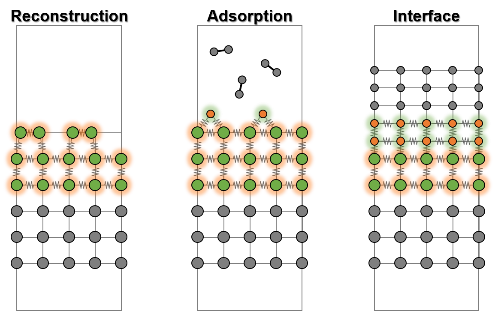
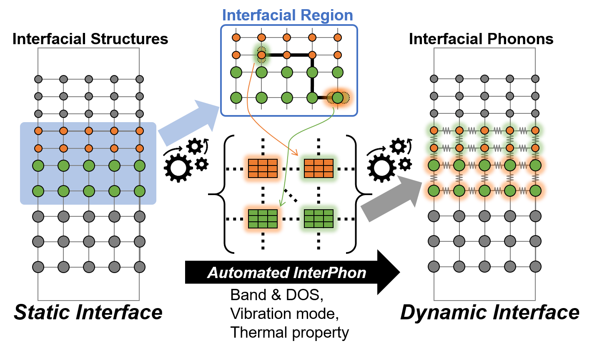
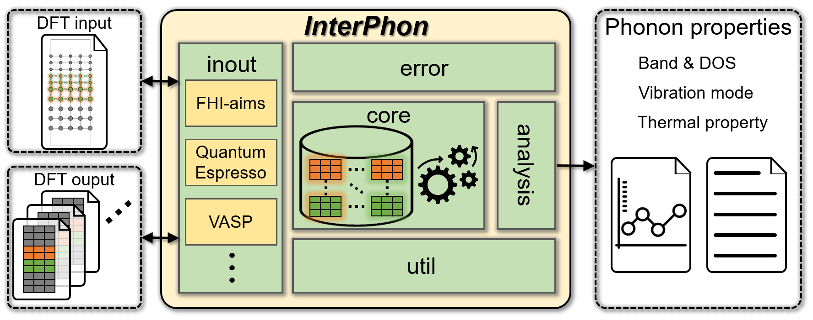

============
Introduction
============

The interfacial region introduces different kinds of vibrations originating from the different stoichiometry
and bonding geometry compared to the bulk environment. However, there has been a limitation in applying
*ab initio* phonon calculations to interfaces due to the excessive computational cost, introduced by
their large number of atoms and broken symmetry. The problems are intrinsically inevitable within
a 3D DFT framework representing interfacial region by supercells having 3D periodicity, as shown in the following figure.
Here, atoms in the vicinity of the interface are shown in green and orange. The atoms embedded in bulk are shown in gray.

Strategy
********

Among all of these atoms, however, the bonding environment of most atoms located far from the interface is similar to
that of the bulk atoms, presenting the same vibrations as the ideal bulk (gray atoms in the above and below figures).
Deviation of vibrations from bulk occurs only on the atoms in the vicinity of the interface (green and orange atoms in the above and below figures).

Therefore, the enormous computational cost can be mitigated by limiting the range of phonon calculations to user-defined interfacial region.
The following figure illustrates the schematic overview of **InterPhon** operation.

In contrast to conventional phonon codes for 3D bulk systems such as Phonopy_ and PHON_,
**InterPhon** calculation proceeds with an interfacial region that is smaller than the full simulation box,
such that the phonons are calculated only for the atoms in the user-defined interfacial region.
In addition, it allows users to define the dimension of periodicity, not limited to 3D.

.. _Phonopy: https://phonopy.github.io/phonopy/
.. _PHON: https://www.sciencedirect.com/science/article/pii/S0010465509001064

Consequently, **InterPhon** enables the efficient extraction of interfacial phonons at arbitrary wave vectors in 1D or 2D
reciprocal space, the corresponding real space being an atomic configuration with 1D or in-plane 2D periodicity,
by automatically processing the information obtained by 3D-based DFT codes.

Overview
********

**InterPhon** operation is based on direct approach using the finite displacement method (FDM).
The input required for the program execution are only a :ref:`label_dft_structure_file` representing the atomic structure of interest
and the corresponding :ref:`label_dft_force_file` providing the forces acting on each atom, in any DFT code format as shown in the following figure of **InterPhon** workflow.

The output is given as :ref:`data files and graphics <label_post_process_property_file>` printing the phonon properties,
including the density of states (DOS), band, vibrational motions (phonon mode), and thermal properties (vibrational entropy and free energy).

Architecture
************

The **InterPhon** package consists of the following five sub-packages:

- ``error`` sub-package includes error modules defined by developer to guide users.

- ``inout`` sub-package includes inout modules to read and write files in different DFT formats.

- ``core`` sub-package includes core modules responsible for the central processes.

- ``util`` sub-package includes util modules to extend the functionality.

- ``analysis`` sub-package includes analysis modules to characterize phonon properties.

The detailed architecture of the package and interrelation among the sub-packages can be found in :ref:`modules <label_architecture>`.
