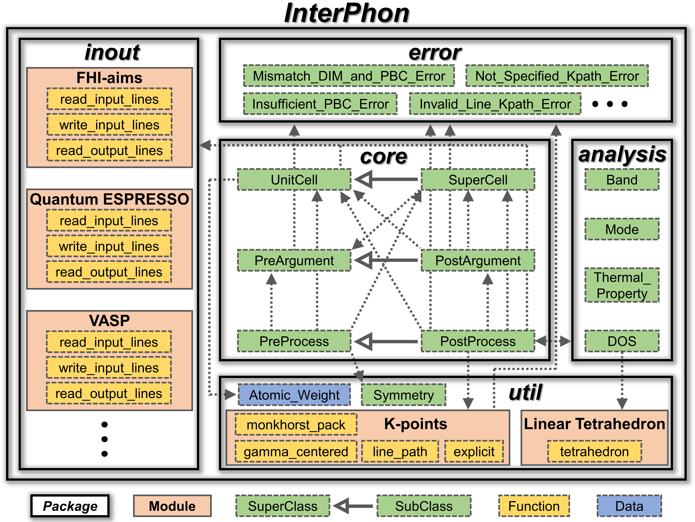

.. _label_architecture:

=======
Modules
=======

The following figure illustrates the **InterPhon** architecture and relationships between the constituent objects.
Here, the boxes underneath represent object types. The thick/solid arrows indicate the inheritance relationship.
The thin/dotted arrows indicate that an object refers to the other object (e.g., instances of the class) to which it points.

.. toctree::

   analysis
   core
   error
   inout
   util
