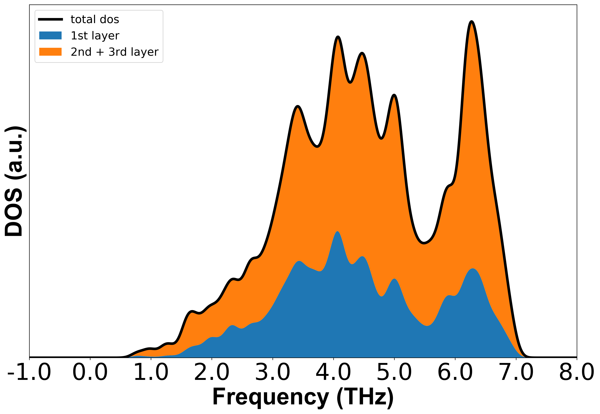
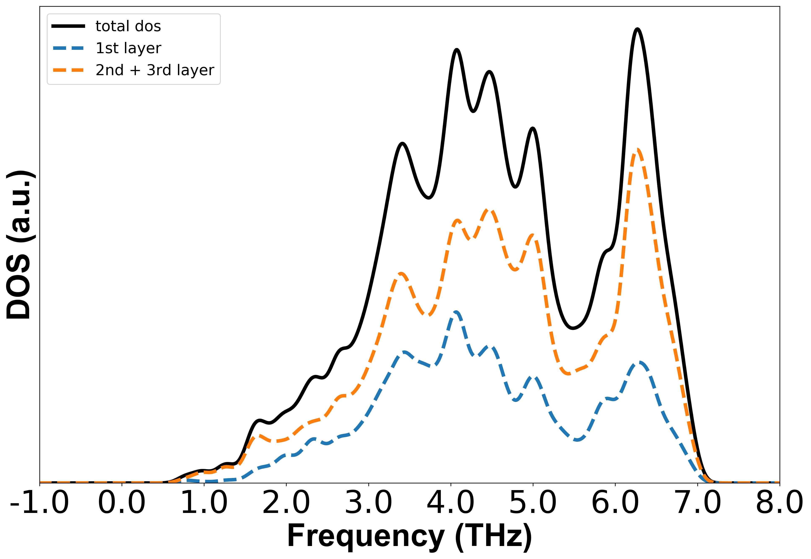
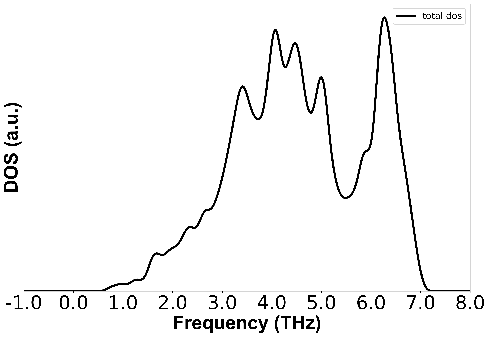
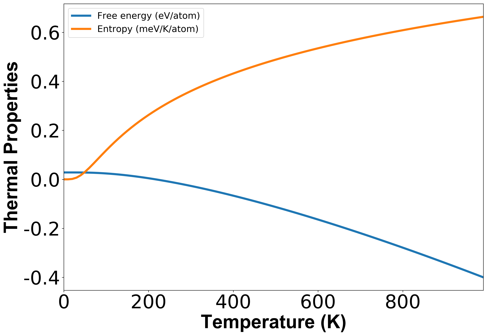
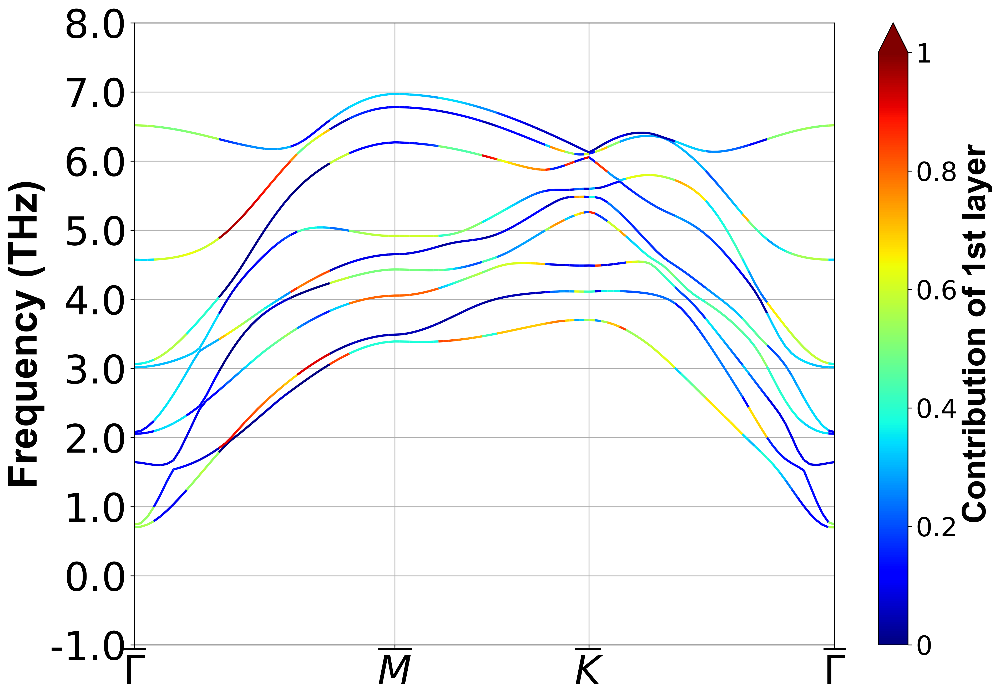
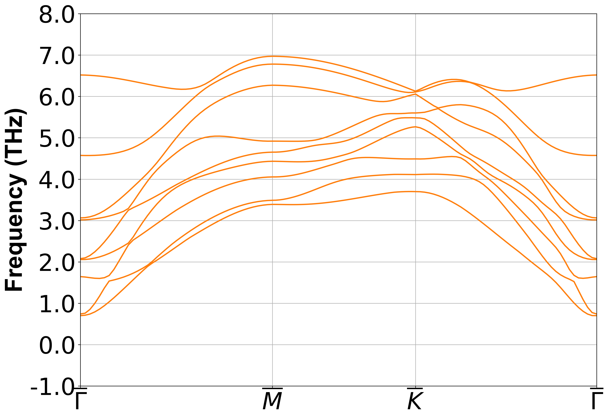
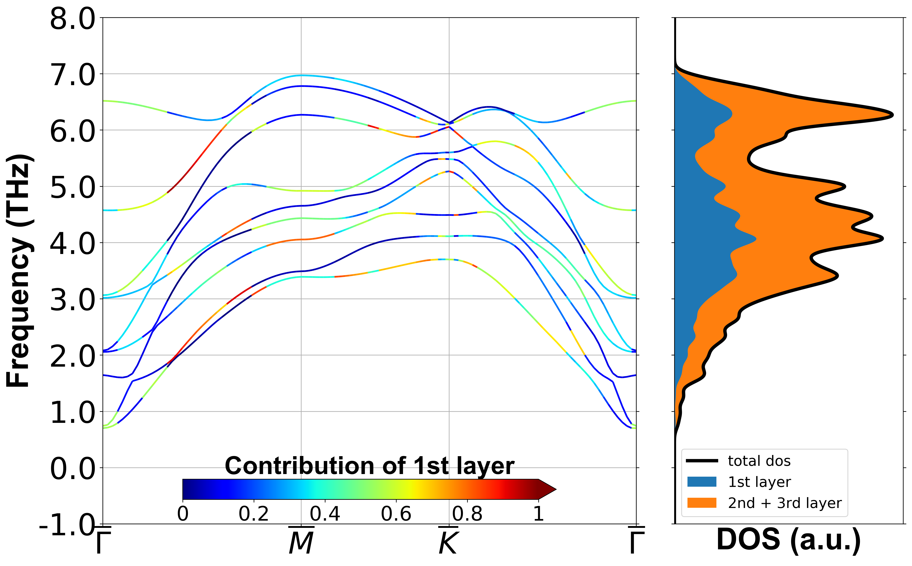

============
Output files
============

Taking the previously mentioned ``Option_file`` :ref:`example <label_option_file_example>`
and ``POSCAR`` :ref:`example of Cu(111) surface <label_Cu(111)_surface_example>`,
examples of the **InterPhon** output are shown below.

Outputs of Pre-process
**********************

Usage::

    $ interphon -enlarge "4 4 1" -pbc "1 1 0"

.. _label_pre_process_record_file:

``pre_process.yaml`` (Pre-process record file)
----------------------------------------------
::

    - unit_cell_file: POSCAR  # This is input file of Pre-process
    - supercell_file: SUPERCELL  # This is output file of Pre-process
    - displaced_supercell_files: POSCAR-{0001..0018}  # This is output file of Pre-process
    - dft_code: vasp
    - user_arguments:
      - displacement: 0.02
      - enlargement: 4 4 1
      - periodicity: 1 1 0
    - unit_cell:
      - lattice_matrix:
          a1: 2.5712952614000000,   0.0000000000000000,   0.0000000000000000
          a2: 1.2856476307000000,   2.2268070170000001,   0.0000000000000000
          a3: 0.0000000000000000,   0.0000000000000000,  27.7901687622000004
      - num_atom: 7
      - selected_atom_index: 4, 5, 6
      - atoms:
        - index: 0
          position: 0.0000000000000000,   0.0000000000000000,   6.2983610850000522
          selection: false
          type: Cu
        - index: 1
          position: 2.5712951080000064,   1.4845379229999942,   8.3978147800000702
          selection: false
          type: Cu
        - index: 2
          position: 1.2856475539999939,   0.7422689609999932,  10.4987696089513474
          selection: false
          type: Cu
        - index: 3
          position: 0.0000000000000000,   0.0000000000000000,  12.6063618648222011
          selection: false
          type: Cu
        - index: 4
          position: 2.5712951080000064,   1.4845379229999942,  14.7139551036653078
          selection: true
          type: Cu
        - index: 5
          position: 1.2856475539999939,   0.7422689609999932,  16.8159162965492293
          selection: true
          type: Cu
        - index: 6
          position: 0.0000000000000000,   0.0000000000000000,  18.9003445564971102
          selection: true
          type: Cu

Outputs of Post-process
***********************

Usage::

    $ interphon FORCE-0*/vasprun.xml -kdos KPOINTS_dos -thermal -kband KPOINTS_band -mode -option Option_file

.. note::
    In the Post-process, the first 4 lines of the ``Option_file`` :ref:`example <label_option_file_example>` are not needed,
    since the :ref:`Basic option tags <label_basic_option_tags>` are automatically read from ``pre_process.yaml``.

.. _label_post_process_record_file:

1. ``post_process.yaml`` (Post-process record file)
---------------------------------------------------
::

    - files:
      - unit_cell_file: POSCAR
      - super_cell_file: SUPERCELL
      - k_point_file_dos: KPOINTS_dos
      - k_point_file_band: KPOINTS_band
      - force_file:
        - FORCE-0001\vasprun.xml
        - FORCE-0002\vasprun.xml
        - FORCE-0003\vasprun.xml
        - FORCE-0004\vasprun.xml
        - FORCE-0005\vasprun.xml
        - FORCE-0006\vasprun.xml
        - FORCE-0007\vasprun.xml
        - FORCE-0008\vasprun.xml
        - FORCE-0009\vasprun.xml
        - FORCE-0010\vasprun.xml
        - FORCE-0011\vasprun.xml
        - FORCE-0012\vasprun.xml
        - FORCE-0013\vasprun.xml
        - FORCE-0014\vasprun.xml
        - FORCE-0015\vasprun.xml
        - FORCE-0016\vasprun.xml
        - FORCE-0017\vasprun.xml
        - FORCE-0018\vasprun.xml
    - dft_code: vasp
    - user_arguments:
      - displacement: 0.02
      - enlargement: 4 4 1
      - periodicity: 1 1 0
    - dos_arguments:
      - flag: true
      - sigma: 0.1
      - num_dos: 1000
      - color: black
      - option: stack
      - orientation: horizontal
      - legend_loc: best
      - atom:
        - - 6
        - - 5
          - 4
      - legend:
        - 1st layer
        - 2nd + 3rd layer
      - elimit:
        - -1
        - 8
    - thermal_arguments:
      - flag: true
      - temp: range(0, 1000, 10)
      - legend_loc: best
    - band_arguments:
      - flag: true
      - color: tab:orange
      - option: projection
      - bar_loc: right
      - bar_label: 1st layer
      - k_label:
        - G
        - M
        - K
        - G
      - atom:
        - 6
      - elimit:
    - mode_arguments:
        flag: true
        index:
        - 0
        k_point:
        - 0.0
        - 0.0
        - 0.0

.. _label_post_process_property_file:

2. ``dos.png`` along with ``total_dos.dat`` and ``projected_dos.dat``
---------------------------------------------------------------------

2.1. :ref:`OPTION_DOS = stack <label_dos_option_dos>`:
^^^^^^^^^^^^^^^^^^^^^^^^^^^^^^^^^^^^^^^^^^^^^^^^^^^^^^

2.2. :ref:`OPTION_DOS = line <label_dos_option_dos>`:
^^^^^^^^^^^^^^^^^^^^^^^^^^^^^^^^^^^^^^^^^^^^^^^^^^^^^^^

2.3. :ref:`OPTION_DOS = plain <label_dos_option_dos>`:
^^^^^^^^^^^^^^^^^^^^^^^^^^^^^^^^^^^^^^^^^^^^^^^^^^^^^^^^

3. ``thermal_properties.png`` along with ``thermal_properties.dat``
-------------------------------------------------------------------

4. ``band.png`` along with ``band.dat``
------------------------------------------------------------

4.1. :ref:`OPTION_BAND = projection <label_band_option_band>`:
^^^^^^^^^^^^^^^^^^^^^^^^^^^^^^^^^^^^^^^^^^^^^^^^^^^^^^^^^^^^^^

4.2. :ref:`OPTION_BAND = plain <label_band_option_band>`:
^^^^^^^^^^^^^^^^^^^^^^^^^^^^^^^^^^^^^^^^^^^^^^^^^^^^^^^^^

5. ``band_dos.png``
------------------------------------------------------------

6. `ASE Visualization <https://wiki.fysik.dtu.dk/ase/ase/visualize/visualize.html#module-ase.visualize>`_ of `Trajectory <https://wiki.fysik.dtu.dk/ase/ase/io/io.html#module-ase.io>`_ along with ``XDATCAR``
--------------------------------------------------------------------------------------------------------------------------------------------------------------------------------------------------------------

